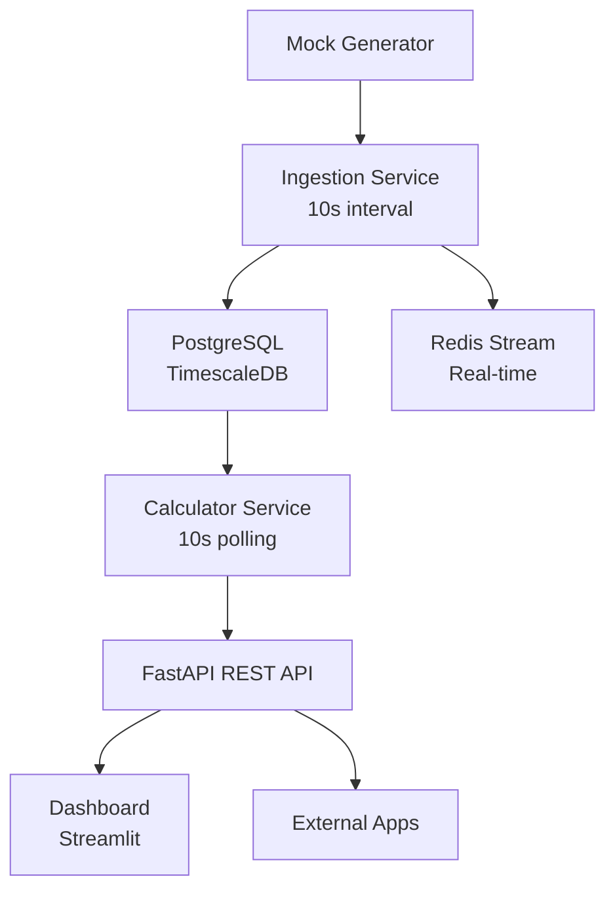
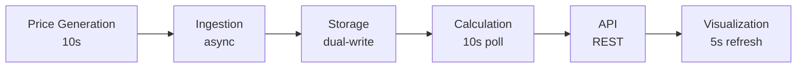

# InTheGrid

**Real-Time European Electricity Arbitrage Detection Platform**

A production-ready proof-of-concept that identifies profitable arbitrage opportunities across European power markets using streaming data pipelines and time-series analytics.

[](https://github.com/yourusername/InTheGrid/actions)
[](https://www.python.org/downloads/)
[](https://opensource.org/licenses/MIT)

## Overview

InTheGrid monitors electricity prices across 5 European markets (Germany, France, Netherlands, Belgium, Austria) and automatically detects arbitrage opportunities where you can buy electricity in one market and sell it in another for profit, accounting for transmission costs.

**Key Features:**
- Real-time ingestion of market prices every 10 seconds
- Automated spread calculation across all market pairs (10 combinations)
- Profit detection accounting for country-specific transmission costs
- Live dashboard with auto-refreshing visualizations
- REST API for programmatic access

**Example Arbitrage:**
```
Buy in Germany:  €60.00/MWh
Sell in France:  €80.00/MWh
Transmission:    -€2.50/MWh
────────────────────────────
Net Profit:      €17.50/MWh
```

## Quick Start

### Prerequisites
- Docker & Docker Compose
- Python 3.12+ (for local development)
- Git

### Launch with Docker
```bash
git clone https://github.com/yourusername/InTheGrid.git
cd InTheGrid
cp .env.example .env

# Start all services
docker compose up -d

# Access services
# Dashboard: http://localhost:8501
# API Docs:  http://localhost:8000/docs
```

### Local Development
```bash
# Start infrastructure
docker compose up -d postgres redis

# Install dependencies
pip install -r requirements.txt

# Run services in separate terminals
python -m src.ingestion
python -m src.calculator
uvicorn src.api:app
streamlit run frontend/app.py
```

## Architecture

### System Overview


### Data Flow


## Key Architectural Decisions

### 1. TimescaleDB Over Standard PostgreSQL
Uses TimescaleDB extension for time-series optimization providing 10-100x faster queries for latest price lookups and automatic time-based partitioning.

### 2. Dual-Write Pattern (PostgreSQL + Redis)
Ingestion service writes to both PostgreSQL (persistent storage) and Redis Stream (real-time messaging) for architectural flexibility and future event-driven consumers.

### 3. Polling Calculator
Calculator polls database every 10 seconds rather than event-driven architecture for simplicity while maintaining Redis Stream infrastructure for future migration.

### 4. Single Dockerfile
One Dockerfile builds image used by all Python services, ensuring dependency consistency and faster builds.

### 5. Mock Data Generator
Simulates realistic market behavior (time-of-day variation, mean reversion, market correlation) to enable immediate development without waiting for API approval.

## Project Structure

```
InTheGrid/
├── src/
│   ├── models.py          # Pydantic data models
│   ├── database.py        # Async PostgreSQL utilities
│   ├── mock_data.py       # Price simulator
│   ├── ingestion.py       # Data ingestion service
│   ├── calculator.py      # Spread calculator
│   └── api.py             # FastAPI endpoints
├── tests/
│   ├── test_mock_data.py
│   ├── test_db.py
│   ├── test_ingestion.py
│   ├── test_calculator.py
│   └── test_api.py
├── frontend/
│   └── app.py             # Streamlit dashboard
├── aws-deployment/
│   ├── deploy.sh          # Automated deployment
│   └── teardown.sh        # Resource cleanup
├── docker-compose.yml
├── Dockerfile
└── init.sql
```

## API Reference

Base URL: `http://localhost:8000`

### GET /health
Health check for monitoring.

```json
{
  "status": "healthy",
  "timestamp": "2025-01-15T10:30:00Z"
}
```

### GET /api/prices/latest
Latest price for each market.

```json
{
  "status": "success",
  "count": 5,
  "prices": [
    {
      "market": "DE",
      "price": 75.50,
      "timestamp": "2025-01-15T10:29:50Z"
    }
  ]
}
```

### GET /api/spreads/opportunities
Current arbitrage opportunities (last 5 minutes, profitable only).

```json
{
  "status": "success",
  "opportunities": [
    {
      "market_pair": "DE-FR",
      "spread": 20.00,
      "net_opportunity": 17.50,
      "low_market": "DE",
      "low_price": 60.00,
      "high_market": "FR",
      "high_price": 80.00,
      "transmission_cost": 2.50,
      "strategy": "Buy in DE at €60.00, sell in FR at €80.00"
    }
  ]
}
```

### GET /api/prices/history/{market}?limit=100
Historical prices for specific market (DE, FR, NL, BE, AT).

## Technology Stack

**Backend:** Python 3.13, FastAPI 0.115, Pydantic 2.9, asyncpg 0.30, Redis 5.2

**Database:** PostgreSQL 15, TimescaleDB 2.x, Redis 7

**Frontend:** Streamlit 1.41, Plotly 5.24, Pandas 2.2

**DevOps:** Docker & Docker Compose, GitHub Actions, pytest 8.3, AWS EC2

## Testing

```bash
# Start infrastructure
docker compose up -d postgres redis

# Run all tests
pytest -v

# Run specific test
pytest tests/test_calculator.py -v
```

**Test Coverage:**
- Unit tests: Mock data validation, database utilities
- Integration tests: Dual-write validation, spread calculation
- API tests: Health check, endpoints, error handling

## AWS Deployment

```bash
cd aws-deployment
./deploy.sh
```

The deployment script automates:
1. AWS CLI validation
2. AMI detection (Ubuntu 24.04)
3. SSH key pair creation
4. Security group configuration
5. EC2 instance launch (t3.micro)
6. Docker installation
7. Application deployment

**Teardown:**
```bash
cd aws-deployment
./teardown.sh
```

## Database Schema

### prices Table (TimescaleDB Hypertable)
```sql
CREATE TABLE prices (
    id SERIAL,
    market VARCHAR(10) NOT NULL,
    timestamp TIMESTAMPTZ NOT NULL,
    price NUMERIC(10, 2) NOT NULL,
    PRIMARY KEY (market, timestamp)
);
SELECT create_hypertable('prices', 'timestamp');
```

### spreads Table
```sql
CREATE TABLE spreads (
    id SERIAL PRIMARY KEY,
    market_pair VARCHAR(20) NOT NULL,
    timestamp TIMESTAMPTZ NOT NULL,
    spread NUMERIC(10, 2) NOT NULL,
    net_opportunity NUMERIC(10, 2) NOT NULL,
    low_market VARCHAR(10) NOT NULL,
    high_market VARCHAR(10) NOT NULL,
    low_price NUMERIC(10, 2) NOT NULL,
    high_price NUMERIC(10, 2) NOT NULL
);
```

## Environment Variables

```bash
# Database
DB_HOST=localhost
DB_PORT=5432
DB_USER=postgres
DB_PASSWORD=postgres
DB_NAME=inthegrid

# Redis
REDIS_HOST=localhost
REDIS_PORT=6379

# API
API_PORT=8000
```

## Troubleshooting

### Services won't start
```bash
docker compose ps
docker compose logs <service>
docker compose restart
```

### Database connection errors
```bash
docker compose exec postgres pg_isready
docker compose down -v  # WARNING: Deletes all data
docker compose up -d
```

### No opportunities detected
```bash
# Check ingestion
docker compose exec postgres psql -U postgres -d inthegrid -c "SELECT COUNT(*) FROM prices;"

# Verify calculator
docker compose logs calculator | grep "Calculated"
```

### Dashboard not updating
```bash
curl http://localhost:8000/health
docker compose logs frontend
```

## Future Enhancements

**Phase 2:** ENTSO-E API integration, data validation, retry logic

**Phase 3:** Event-driven calculator, WebSocket endpoints, alert engine

**Phase 4:** Authentication, rate limiting, Prometheus metrics, Kubernetes deployment

**Phase 5:** Market correlation analysis, ML price prediction, pattern analysis

## Development Timeline

Built incrementally over approximately 3 days:

| Phase | Description | Time |
|-------|-------------|------|
| P1 | Database setup | 1h |
| P2 | Mock data generator | 2h |
| P3 | Ingestion service | 1.5h |
| P4 | Spread calculator | 1.5h |
| P5 | FastAPI backend | 2h |
| P6 | Streamlit dashboard | 2h |
| P7 | Docker integration | 1h |
| P8 | Documentation + CI/CD | 1h |

## Contributing

1. Fork the repository
2. Create a feature branch
3. Run tests (`pytest -v`)
4. Submit a pull request

## License

MIT License - see LICENSE file for details.

## Contact

**Author:** Shawn Teo
**Project:** InTheGrid - Energy Arbitrage Detection
**Status:** Production-ready POC

For questions or feedback, please open an issue on GitHub.
