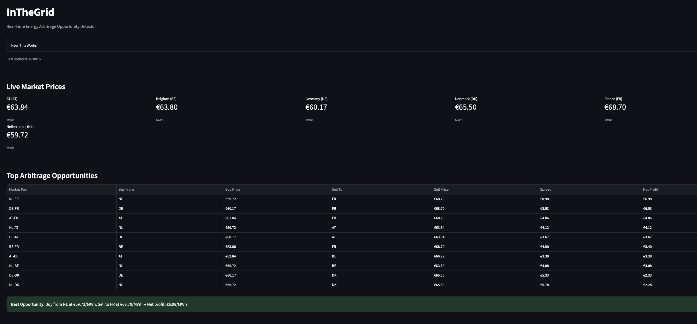
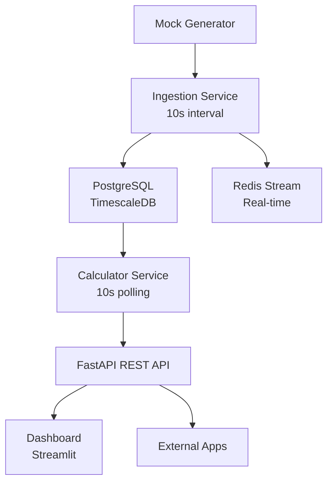
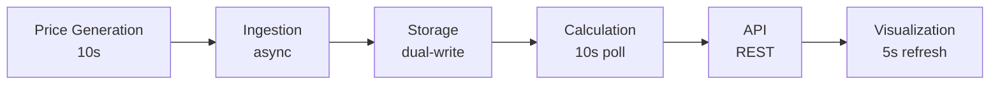

# InTheGrid

**Real-Time European Electricity Arbitrage Detection Platform**

A proof-of-concept that identifies profitable arbitrage opportunities across European power markets using streaming data pipelines and time-series analytics.

## Overview

InTheGrid is a dashboard that aims to monitors electricity prices across 5 European markets (Germany, France, Netherlands, Belgium, Austria) and automatically detects arbitrage opportunities where you can buy electricity in one market and sell it in another for profit, accounting for transmission costs.

> **Note:** This POC currently uses **simulated market data** with realistic pricing characteristics (time-of-day variation, market correlation, mean reversion). The architecture is designed to seamlessly integrate real data from the ENTSO-E Transparency Platform API in the future.

**Key Features:**
- Real-time ingestion of market prices every 10 seconds
- Automated spread calculation across all market pairs (10 combinations)
- Profit detection accounting for country-specific transmission costs
- Live dashboard with auto-refreshing visualizations
- REST API for programmatic access

**Example Arbitrage:**
```
Buy in Germany:  €60.00/MWh
Sell in France:  €80.00/MWh
Transmission:    -€2.50/MWh
────────────────────────────
Net Profit:      €17.50/MWh
```
### Live Dashboard


## Quick Start

### Prerequisites
- Docker & Docker Compose
- Python 3.12+ (for local development)
- Git

### Launch with Docker
```bash
git clone https://github.com/yourusername/InTheGrid.git
cd InTheGrid
cp .env.example .env

# Start all services
docker compose up -d

# Start frontend 
streamlit run frontend/app.py  

# Access services
# Dashboard: http://localhost:8501
# API Docs:  http://localhost:8000/docs
```

### Local Development
```bash
# Start infrastructure
docker compose up -d postgres redis

# Install dependencies
pip install -r requirements.txt

# Run services in separate terminals
python -m src.ingestion
python -m src.calculator
uvicorn src.api:app
streamlit run frontend/app.py
```

## Architecture

### System Overview


### Data Flow


## Key Architectural Decisions

### 1. TimescaleDB Over Standard PostgreSQL
Uses TimescaleDB extension for time-series optimization providing 10-100x faster queries for latest price lookups and automatic time-based partitioning.

### 2. Dual-Write Pattern (PostgreSQL + Redis)
Ingestion service writes to both PostgreSQL (persistent storage) and Redis Stream (real-time messaging) for architectural flexibility and future event-driven consumers.

### 3. Polling Calculator
Calculator polls database every 10 seconds rather than event-driven architecture for simplicity while maintaining Redis Stream infrastructure for future migration.

### 4. Single Dockerfile
One Dockerfile builds image used by all Python services, ensuring dependency consistency and faster builds.

### 5. Mock Data Generator (Current Implementation)
**Currently using simulated data** to demonstrate the platform's capabilities. The mock generator simulates realistic market behavior including:
- **Time-of-day variation:** Peak hours (8am-8pm) have 1.3x pricing, off-peak 0.8x
- **Mean reversion:** Prices drift back to market base values
- **Market correlation:** Germany-Netherlands prices move together (interconnected grids)
- **Realistic volatility:** ±€2 random walk mimicking actual market behavior

This approach enabled immediate development without needing for immeditate ENTSO-E API integration which may introduce more complexity. The architecture supports drop-in replacement with real data sources via a simple module swap.

## Project Structure

```
InTheGrid/
├── src/
│   ├── models.py          # Pydantic data models
│   ├── database.py        # Async PostgreSQL utilities
│   ├── mock_data.py       # Price simulator
│   ├── ingestion.py       # Data ingestion service
│   ├── calculator.py      # Spread calculator
│   └── api.py             # FastAPI endpoints
├── tests/
│   ├── test_mock_data.py
│   ├── test_db.py
│   ├── test_ingestion.py
│   ├── test_calculator.py
│   └── test_api.py
├── frontend/
│   └── app.py             # Streamlit dashboard
├── aws-deployment/
│   ├── deploy.sh          # Automated deployment
│   └── teardown.sh        # Resource cleanup
├── docker-compose.yml
├── Dockerfile
└── init.sql
```

## API Reference

Base URL: `http://localhost:8000`

### GET /health
Health check for monitoring.

```json
{
  "status": "healthy",
  "timestamp": "2025-01-15T10:30:00Z"
}
```

### GET /api/prices/latest
Latest price for each market.

```json
{
  "status": "success",
  "count": 5,
  "prices": [
    {
      "market": "DE",
      "price": 75.50,
      "timestamp": "2025-01-15T10:29:50Z"
    }
  ]
}
```

### GET /api/spreads/opportunities
Current arbitrage opportunities (last 5 minutes, profitable only).

```json
{
  "status": "success",
  "opportunities": [
    {
      "market_pair": "DE-FR",
      "spread": 20.00,
      "net_opportunity": 17.50,
      "low_market": "DE",
      "low_price": 60.00,
      "high_market": "FR",
      "high_price": 80.00,
      "transmission_cost": 2.50,
      "strategy": "Buy in DE at €60.00, sell in FR at €80.00"
    }
  ]
}
```

### GET /api/prices/history/{market}?limit=100
Historical prices for specific market (DE, FR, NL, BE, AT).

## Technology Stack

**Backend:** Python 3.13, FastAPI 0.115, Pydantic 2.9, asyncpg 0.30, Redis 5.2

**Database:** PostgreSQL 15, TimescaleDB 2.x, Redis 7

**Frontend:** Streamlit 1.41, Plotly 5.24, Pandas 2.2

**DevOps:** Docker & Docker Compose, GitHub Actions, pytest 8.3, AWS EC2

## Testing

```bash
# Start infrastructure
docker compose up -d postgres redis

# Run all tests
pytest -v

# Run specific test
pytest tests/test_calculator.py -v
```

**Test Coverage:**
- Unit tests: Mock data validation, database utilities
- Integration tests: Dual-write validation, spread calculation
- API tests: Health check, endpoints, error handling

## Development Timeline

Built incrementally over approximately 3 days:

| Phase | Description |
|-------|-------------|
| P1 | Database setup
| P2 | Mock data generator 
| P3 | Ingestion service 
| P4 | Spread calculator
| P5 | FastAPI backend 
| P6 | Streamlit dashboard 
| P7 | Docker integration 
| P8 | Documentation + CI/CD 
